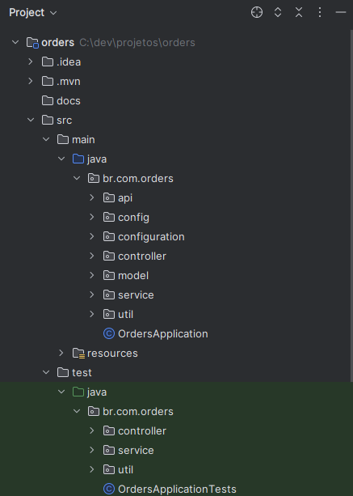
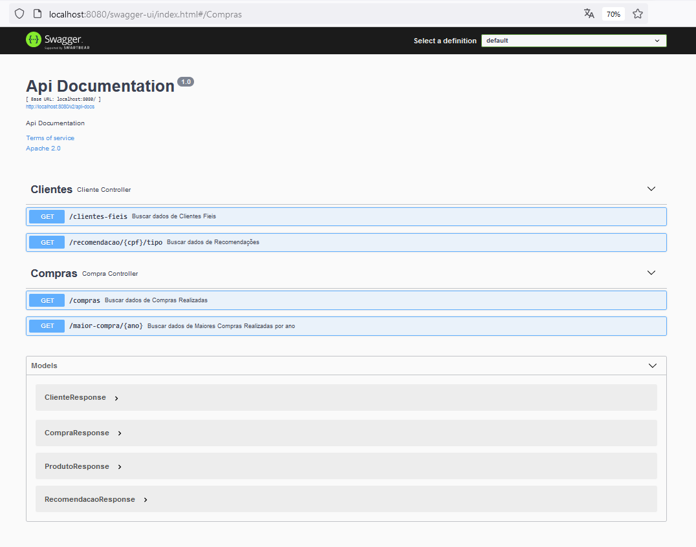
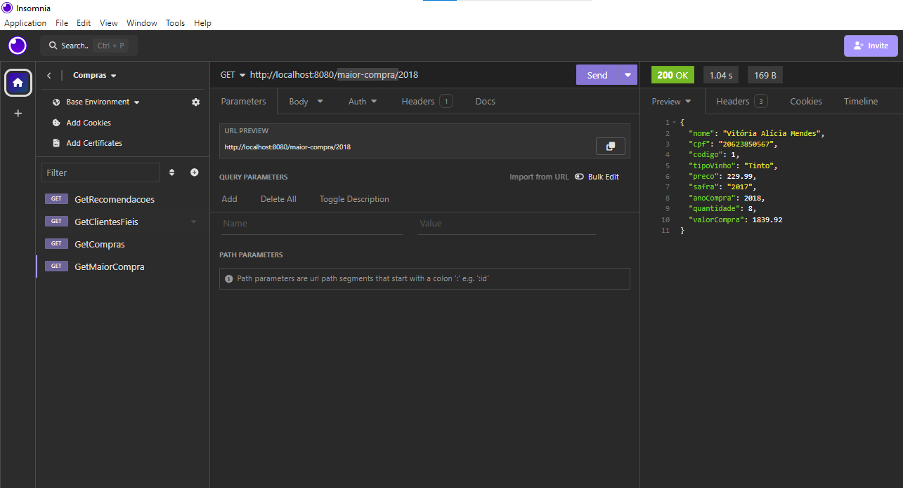
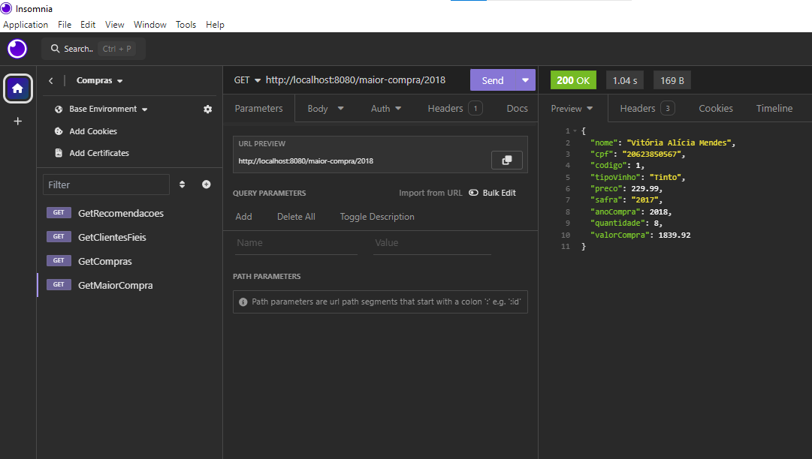
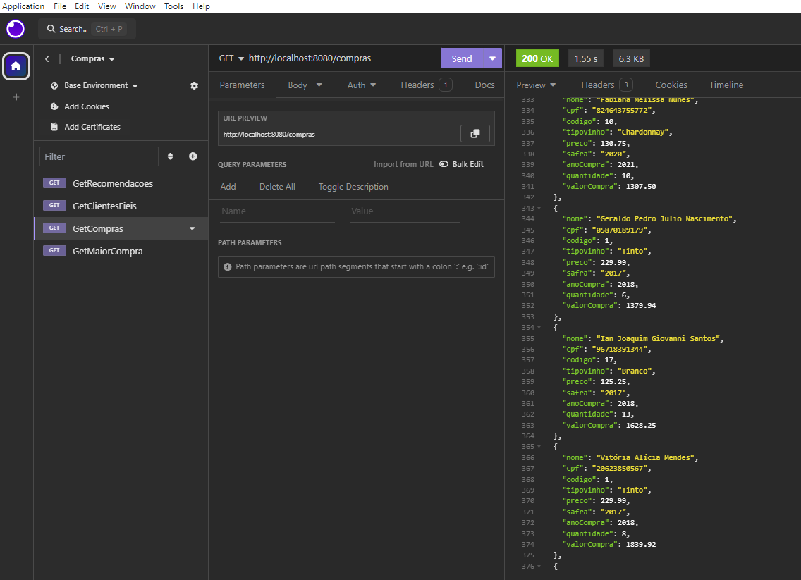
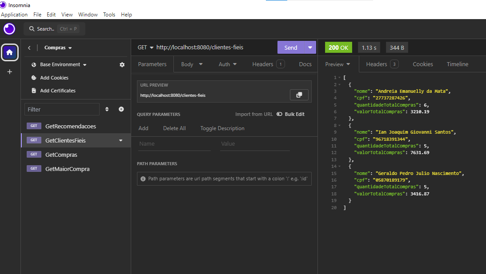
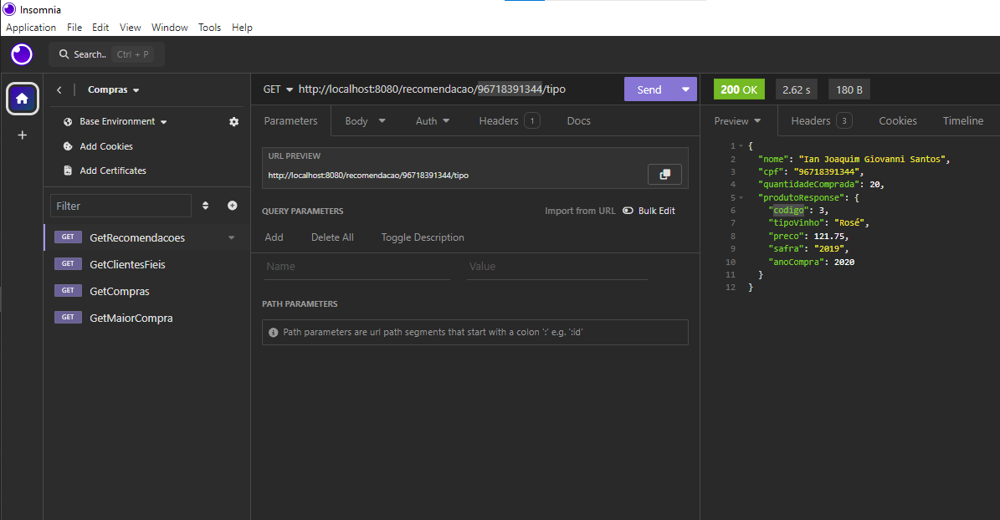

# Projeto Java 17 com spring boot 2.7

Consulta de clientes e consulta de dados de Compras

## 🚀 Início.

O principal objetivo do projeto é integrar várias tecnologias em uma aplicação de microserviço Spring boot.

## 🛠 Tecnologias.

<ol>
  <li>Java</li>
  <li>Spring boot</li>
  <li>Mockito</li>
  <li>Junit</li>
  <li>log4j2</li>
  <li>Swagger</li>
  <li>Insomnia</li>
</ol>

## ⚙️ Estrutura.

## ⚙️ Execução do projeto.

~~~~shell
mvn spring-boot:run
~~~~

## ⚙️ Swagger.

* [http://localhost:8080/swagger-ui/index.html#/](http://localhost:8080/swagger-ui/index.html#/)

## ⚙️ Teste com Insomnia - Collection.

* [docs/Insomnia_collection.json](docs/Insomnia_collection.json)

## ⚙️ Teste com Insomnia - Get Maior Compra.

## ⚙️ Teste com Insomnia - Get Compras.

## ⚙️ Teste com Insomnia - Get Clientes Fieis.

## ⚙️ Teste com Insomnia - Get Recomendação.

## ✒️ Autor.

André Alves Pinto - andrealvesdeveloper@gmail.com